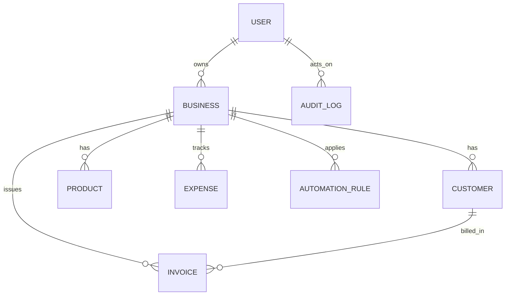

# GST & Business Automation SaaS (MERN)

A production-style MERN starter for an Indian GST-focused SaaS competitor with multi-business tenancy, invoicing, automation hooks, AI insights, and role-based access.

## Tech Stack
- Frontend: React, Tailwind CSS, Zustand, TanStack Query, Chart.js, PWA
- Backend: Node.js, Express, JWT + Refresh Tokens, RBAC, validation, Swagger
- Database: MongoDB + Mongoose with tenant-aware indexes

## Folder Structure
```txt
.
├── client/
│   ├── public/
│   ├── src/
│   │   ├── api/
│   │   ├── app/
│   │   ├── components/
│   │   ├── features/
│   │   ├── layouts/
│   │   ├── pages/
│   │   └── utils/
│   ├── index.html
│   ├── package.json
│   └── vite.config.js
├── server/
│   ├── src/
│   │   ├── config/
│   │   ├── controllers/
│   │   ├── docs/
│   │   ├── jobs/
│   │   ├── middlewares/
│   │   ├── models/
│   │   ├── routes/
│   │   ├── scripts/
│   │   ├── services/
│   │   ├── utils/
│   │   ├── validations/
│   │   ├── app.js
│   │   └── server.js
│   ├── .env.example
│   └── package.json
└── README.md
```

## Database Schema (Mermaid ER)


## Features included
- Email/password authentication + refresh tokens.
- Role-based access (owner/admin/staff).
- Brute-force lockout protection.
- Multi-business membership support.
- GST invoice calculation + payment tracking.
- Profit dashboard + AI summary text.
- Automation rule model + overdue cron job.
- Seeded demo account and sample business data.

## Setup from scratch
### Prerequisites
- Node.js 20+
- MongoDB local or cloud

### 1) Backend setup
```bash
cd server
cp .env.example .env
npm install
npm run seed
npm run dev
```
Backend runs on `http://localhost:5000`.
Swagger UI: `http://localhost:5000/api/docs`

### 2) Frontend setup
```bash
cd client
npm install
npm run dev
```
Frontend runs on `http://localhost:5173`.

### 3) Demo login
- Email: `demo@gstsaas.com`
- Password: `Demo@1234`

## Key API endpoints
- `POST /api/auth/register`
- `POST /api/auth/login`
- `POST /api/auth/refresh`
- `GET /api/businesses`
- `GET /api/dashboard`
- `GET /api/invoices`
- `POST /api/invoices`
- `POST /api/invoices/:id/payments`
- `GET /api/expenses`
- `POST /api/expenses`
- `GET /api/customers`
- `POST /api/customers`

## Production notes
- Add Redis queue (BullMQ) for durable automation execution.
- Integrate WhatsApp/SMS/email providers (e.g. Twilio/Meta/MSG91) in `services/automationService.js`.
- Add Razorpay/Stripe subscription webhooks and usage metering.
- Add full test suite (Jest + Supertest, React Testing Library).
